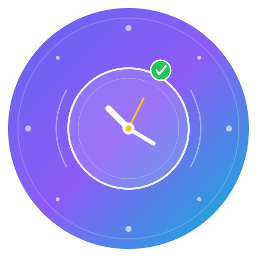

<div align="center">
  
  <h1>LifeSync - 智能时间管理与目标追踪系统</h1>
  <p>
    <strong>现代化桌面应用 | 跨平台支持 | 多语言界面 | 数据同步</strong>
  </p>
  
  <p>
    <a href="#特性">特性</a> •
    <a href="#快速开始">快速开始</a> •
    <a href="#安装指南">安装指南</a> •
    <a href="#使用说明">使用说明</a> •
    <a href="#技术栈">技术栈</a> •
    <a href="#开发指南">开发指南</a> •
    <a href="#许可证">许可证</a>
  </p>
  
  <p>
    
    
    
    
    
    
  </p>
</div>

## 📋 项目简介

**LifeSync** 是一款现代化的时间管理与目标追踪桌面应用程序，旨在帮助用户高效规划日程、追踪目标进度、分析时间使用情况，并通过云端同步实现多设备数据一致性。

### 核心设计理念
- **计划与实际对比**：可视化对比每日计划与实际执行情况
- **目标导向**：将长期目标分解为可执行的任务和里程碑
- **数据驱动**：通过图表分析时间使用模式和效率趋势
- **跨平台同步**：支持WebDAV云端同步，确保数据安全与可访问性

## ✨ 特性

### 📅 日程管理
- **时间块规划**：直观的拖拽式时间块安排，支持15分钟精度调整
- **计划与实际对比**：并排显示计划任务和实际执行情况
- **模板系统**：保存常用日程安排为模板，一键应用
- **移动端适配**：响应式设计，完美支持手机和平板设备

### 🎯 目标管理
- **目标分层系统**：原理层 → 方法层 → 应用层的三层目标体系
- **里程碑追踪**：将大目标分解为可量化的里程碑
- **进度可视化**：实时显示目标完成百分比和剩余工作量
- **目标关联任务**：将目标直接拖拽到日程中创建关联任务

### 📊 统计分析
- **多维度图表**：支持时间资本、执行效率、应用使用、趋势分析等多种图表类型
- **时间范围选择**：日/周/月/年不同时间粒度的数据分析
- **设备使用监控**：集成设备监控服务，追踪应用使用情况
- **导出功能**：支持数据导出为JSON格式

### 🔄 同步与备份
- **WebDAV同步**：支持Nextcloud、OwnCloud等WebDAV协议云端同步
- **本地备份**：自动保存数据到浏览器本地存储
- **数据导入导出**：完整的数据迁移和备份功能
- **跨设备一致性**：确保多设备间的数据同步

### 🌐 国际化
- **多语言支持**：中文简体、中文繁体、英语、日语、韩语、俄语
- **主题切换**：亮色/暗色主题，支持系统主题跟随
- **无障碍设计**：考虑视觉障碍用户的可用性

## 🚀 快速开始

### 环境要求
- **Node.js** 18.0.0 或更高版本
- **npm** 9.0.0 或 **pnpm** 8.0.0 或 **yarn** 1.22.0
- **Git** (用于克隆仓库)

### 一键启动
```bash
# 克隆项目
git clone https://github.com/yourusername/lifesync-desktop.git
cd lifesync-desktop

# 安装依赖
npm install  # 或 pnpm install 或 yarn install

# 启动开发服务器
npm run dev
```

访问 http://localhost:3000 即可使用Web版本。

## 📦 安装指南

### 桌面应用安装

#### Electron版本 (跨平台)
```bash
# 开发模式运行
npm run electron

# 构建安装包
# (需要配置相应平台的构建环境)
```

#### Tauri版本 (轻量级)
```bash
# 开发模式运行
npm run tauri:dev

# 构建安装包
npm run tauri:build
```

### 环境变量配置
1. 创建或编辑 `.env.local` 文件
2. 配置必要的环境变量：
```env
# Gemini API密钥 (可选，用于AI功能扩展)
GEMINI_API_KEY=your_api_key_here

# 开发服务器端口 (可选)
PORT=3000
```

## 🖥️ 使用说明

### 基本工作流程
1. **设置目标**：在"目标"页面创建长期目标，分解为里程碑
2. **规划日程**：在"计划"页面拖拽目标或创建任务到时间线
3. **执行追踪**：标记任务完成状态，记录实际执行情况
4. **分析改进**：在"统计"页面查看时间使用报告，优化计划

### 快捷键
- `Ctrl/Cmd + N`：新建任务
- `Ctrl/Cmd + S`：保存模板
- `Ctrl/Cmd + L`：切换语言
- `Ctrl/Cmd + D`：切换暗色/亮色主题
- `Esc`：关闭当前对话框

### 数据同步设置
1. 进入"设置" → "同步"页面
2. 配置WebDAV服务器信息（URL、用户名、密码）
3. 启用同步功能
4. 点击"立即同步"测试连接

## 🏗️ 技术栈

### 前端框架
- **React 19** - 用户界面库
- **TypeScript** - 类型安全的JavaScript超集
- **Vite** - 下一代前端构建工具
- **Tailwind CSS** - 实用优先的CSS框架

### 桌面应用框架
- **Electron** - 跨平台桌面应用框架
- **Tauri** - 轻量级安全的桌面应用框架（备选）

### 数据可视化
- **ECharts** - 强大的图表库
- **Lucide React** - 精美的图标库

### 数据同步
- **WebDAV客户端** - 云端同步协议
- **LocalStorage API** - 本地数据持久化

### 开发工具
- **ESLint** - 代码质量检查
- **PostCSS** - CSS处理
- **Autoprefixer** - 浏览器前缀自动添加

## 🛠️ 开发指南

### 项目结构
```
lifesync-desktop/
├── src/                    # 源代码目录 (Vite入口)
│   ├── components/        # React组件
│   │   ├── SchedulePanel.tsx    # 日程面板
│   │   ├── GoalManager.tsx      # 目标管理
│   │   ├── StatsChart.tsx       # 统计图表
│   │   └── Toast.tsx            # 通知组件
│   ├── services/          # 服务层
│   │   ├── syncService.ts       # 同步服务
│   │   ├── webdavService.ts     # WebDAV服务
│   │   ├── deviceMonitor.ts     # 设备监控
│   │   ├── exportService.ts     # 数据导出服务
│   │   └── notificationService.ts # 通知服务
│   ├── types.ts           # TypeScript类型定义
│   ├── utils.ts           # 工具函数
│   └── App.tsx            # 主应用组件
├── components/            # 共享组件目录 (根级别)
│   ├── DailyPlanList.tsx      # 每日计划列表
│   ├── GoalEditorModal.tsx    # 目标编辑模态框
│   ├── GoalManager.tsx        # 目标管理器
│   ├── GoalPanel.tsx          # 目标面板
│   ├── SchedulePanel.tsx      # 日程面板
│   ├── SettingsPanel.tsx      # 设置面板
│   ├── SidebarTodoPanel.tsx   # 侧边栏待办面板
│   ├── StatsChart.tsx         # 统计图表
│   └── TaskEditorModal.tsx    # 任务编辑模态框
├── electron/              # Electron主进程代码
│   ├── main.js           # 主进程入口
│   └── preload.js        # 预加载脚本
├── services/             # 共享服务目录 (根级别)
│   ├── deviceMonitor.ts  # 设备监控服务
│   ├── mockDeviceService.ts # 模拟设备服务
│   ├── syncService.ts    # 同步服务
│   └── webdavService.ts  # WebDAV服务
├── public/               # 静态资源
├── icons/                # 应用图标 (多尺寸)
├── vite.config.ts        # Vite配置
├── package.json          # 项目依赖和脚本
├── tsconfig.json         # TypeScript配置
├── index.html           # HTML入口文件
└── README.md            # 项目说明文档
```

**注意**：项目采用了混合目录结构，既有 `src/` 目录用于Vite构建入口，也有根级别的 `components/` 和 `services/` 目录用于共享代码。这种设计支持多种构建目标（Web、Electron、Tauri）。

### 开发命令
```bash
# 开发服务器 (Web版本)
npm run dev

# Electron开发模式
npm run electron

# Tauri开发模式
npm run tauri:dev

# 代码检查
npm run lint

# 构建生产版本
npm run build

# 预览生产构建
npm run preview
```

### 添加新功能
1. 在 `src/types.ts` 中定义相关类型
2. 在 `src/components/` 中创建React组件
3. 在 `src/services/` 中实现业务逻辑
4. 在 `src/utils.ts` 中添加工具函数
5. 更新多语言翻译（如需）

### 添加新语言
1. 在 `src/utils.ts` 的翻译字典中添加新语言条目
2. 在界面语言选择器中添加新选项
3. 确保所有界面文本都使用 `t()` 函数包装

## 🤝 贡献指南

我们欢迎任何形式的贡献！请遵循以下步骤：

### 报告问题
1. 在GitHub Issues中搜索是否已有类似问题
2. 创建新Issue，详细描述问题现象、复现步骤和期望结果
3. 提供操作系统、浏览器/Electron版本等信息

### 提交代码
1. Fork本仓库
2. 创建功能分支 (`git checkout -b feature/amazing-feature`)
3. 提交更改 (`git commit -m 'Add some amazing feature'`)
4. 推送到分支 (`git push origin feature/amazing-feature`)
5. 创建Pull Request

### 代码规范
- 使用TypeScript并启用严格模式
- 遵循ESLint配置的代码风格
- 为公共API添加JSDoc注释
- 确保新功能有相应的测试（如有）

## 📄 许可证

本项目采用 **MIT许可证** - 查看 [LICENSE](LICENSE) 文件了解详情。

## 🙏 致谢

- **React团队** - 出色的UI框架
- **Electron团队** - 跨平台桌面应用解决方案
- **Vite团队** - 快速的前端构建工具
- **所有贡献者** - 感谢你们的代码和反馈

## 📞 支持与联系

- **问题反馈**：[GitHub Issues](https://github.com/yourusername/lifesync-desktop/issues)
- **功能建议**：[GitHub Discussions](https://github.com/yourusername/lifesync-desktop/discussions)
- **电子邮件**：support@lifesync.app

---

<div align="center">
  <sub>构建高效生活，从规划每一分钟开始 ✨</sub>
</div>
